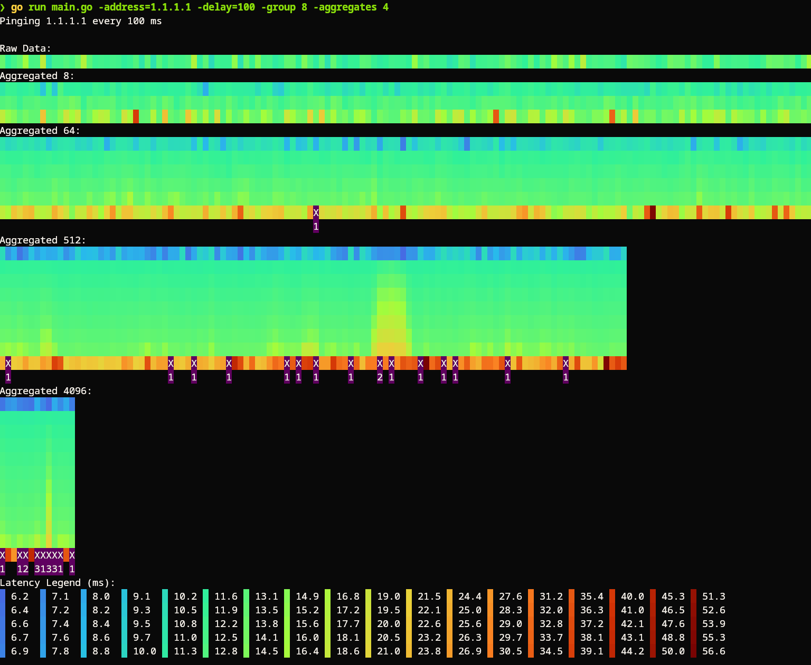

# Pingback

Pingback is a network latency monitor built in Go. It displays latency as a scrolling heatmap, providing a visual representation of network performance & reliability.

## Setup

```sh
go build
```

## Usage

Pingback is only known to work on linux. It might work on MacOS and will not work on Windows without modification. 
Refer to [these instructions](https://github.com/prometheus-community/pro-bing#supported-operating-systems) for more information.
On Linux, you need to set the following:

```sh
sudo sysctl -w net.ipv4.ping_group_range="0 2147483647"
```

Then you can run Pingback like this:

```sh
pingback -address=<IP_or_URL> [-delay=<milliseconds>] [-group=<groupSize>] [-aggregates=<number>]
```

Options:

- `-address`: The IP or URL to ping.
- `-delay`: Time between pings in milliseconds (default is 1000ms).
- `-group`: Number of samples to aggregate together (default is 32).
- `-aggregates`: Number of aggregate charts to show (default is 2).

### Example

To ping `example.com` every 500 milliseconds, use:

```sh
pingback -address=example.com -delay=500
```

By default, Pingback displays latency data in three charts: one for real-time values, one for mid-term averages, and one for long-term trends. Latency values are represented as colored rectangles, ranging from blue (low latency) to red (high latency). A dark purple `X` indicates a dropped packet.

### Aggregates

Each aggregate chart aggregates `-group` elements from the previous chart, and displays a statistical overview of them. The overview is a set of evenly spaced [order statistics](https://en.wikipedia.org/wiki/Order_statistic). The number of statistics depends on the log2 of the elements that are to be aggregated.

The upper rows show smaller values than the lower rows.

## Screnshots
    


## Contributing

Contributions to improve Pingback are welcome. Please open an issue or submit a pull request.

## License

Pingback is open-source and licensed under the MIT License.

## Acknowledgments

Pingback was built using [Bubble Tea](https://github.com/charmbracelet/bubbletea) for the TUI framework and [pro-bing](https://github.com/prometheus-community/pro-bing) for ICMP pinging. Thanks to the community for these fantastic tools!
